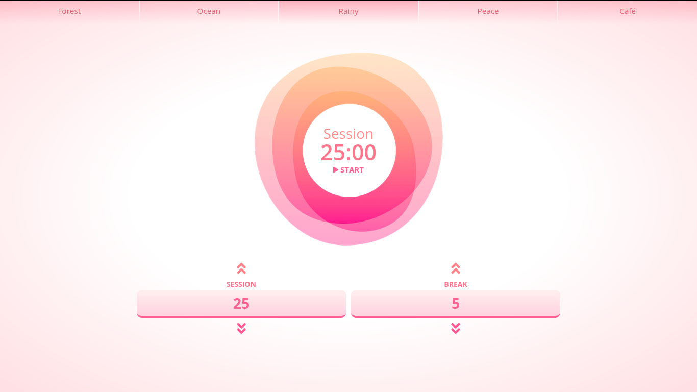

# Tide App (Pomodoro Timer)

- Site [here](https://tideapp.netlify.app/)
- The Pomodoro Technique is a popular time-management method invented by Italian Francesco Cirillo.

### Basics of pomodoro technique

- Pick one project or task you want to focus on.
- Set a timer for 25-30 minutes, and get to work.

- When the buzzer sounds, take a two-to-three-minute break.

- Repeat.

- After four sessions, take a longer break.

